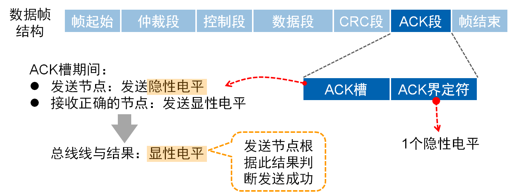
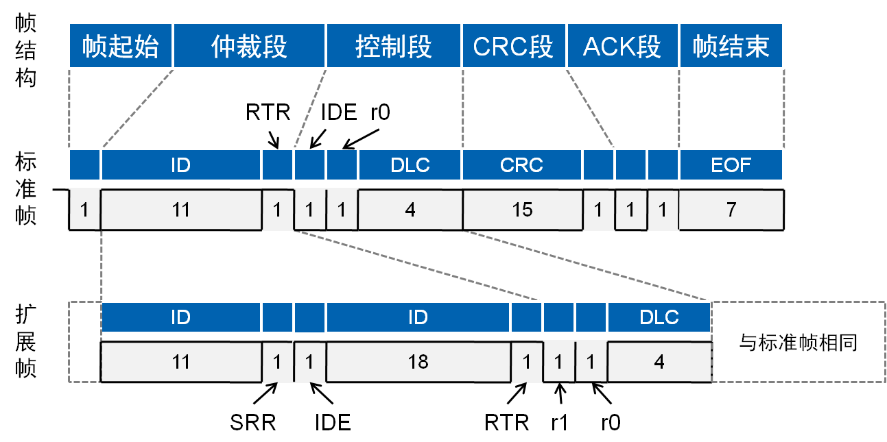
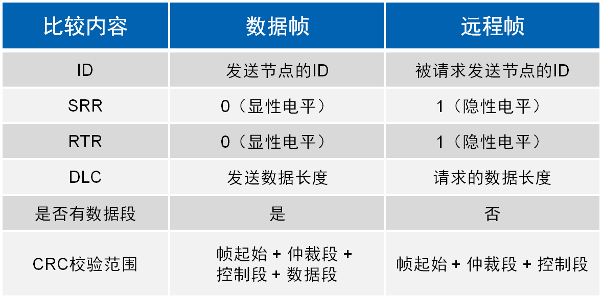
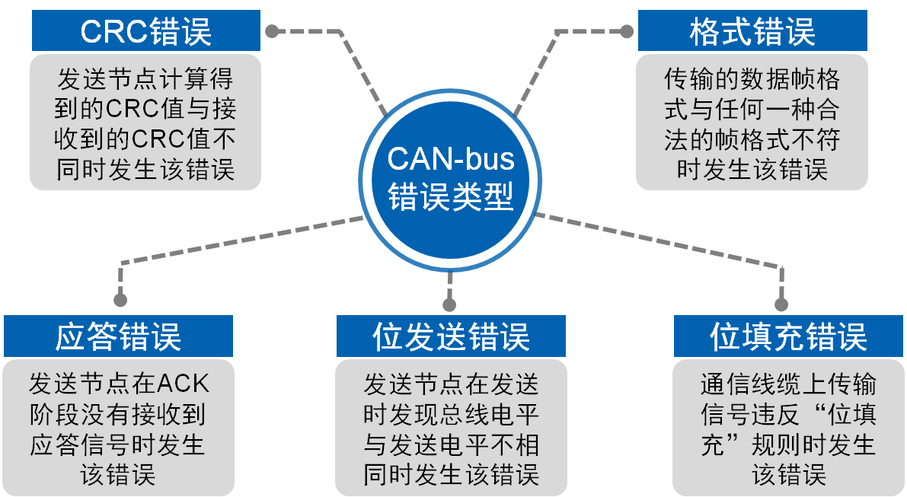
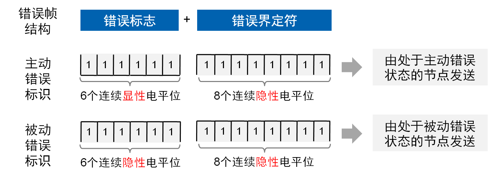
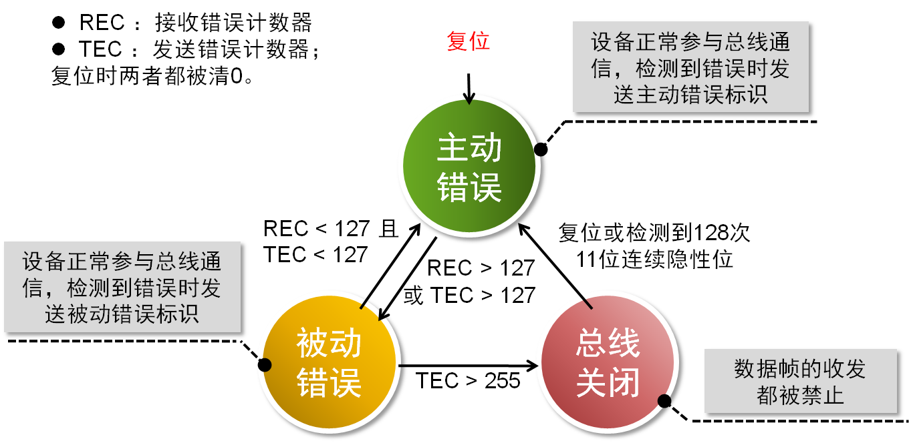
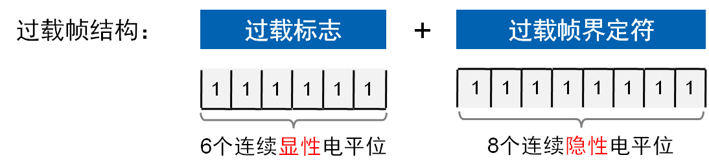
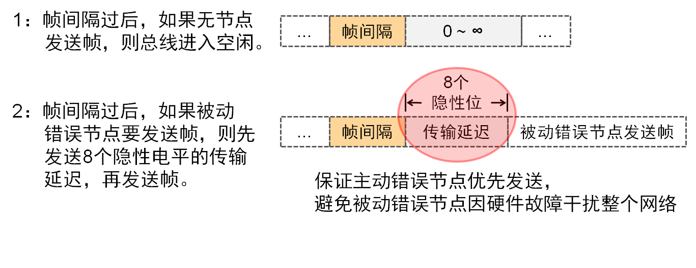

# CAN-bus data link layer -- 数据链路层

* 概述
* 数据帧
* 远程帧
* 错误帧
* 过载帧和帧间隔
* 小结

### 概述

#### 帧分类

CAN-bus通信帧共分为**数据帧**、**远程帧**、**错误帧**、**过载帧**和**帧间隔**5种类型。 

* 数据帧：用于发送节点向接收节点传送数据，是使用最多的帧类型
* 远程帧：用于接收节点向某个发送节点请求数据
* 错误帧：用于当某节点检测出错误时向其他节点通知错误的帧
* 过载帧：用于接收节点向发送节点通知自身接收能力的帧
* 帧间隔：用于将数据帧或远程帧与前面的帧分离的帧

### 数据帧

数据帧是使用最多的帧，结构上由7个段组成，其中根据仲裁段ID码长度的不同，分为**标准帧（CAN2.0A）**和**扩展帧（CAN2.0B）**。

#### 帧起始和帧结束

帧起始和帧结束用于界定一个数据帧，无论是标准数据帧或扩展数据帧都包含这两个段。

#### 仲裁段

CAN-bus并没有规定节点的优先级，但通过仲裁段帧ID规定了数据帧的优先级。根据CAN2.0标准版本不同，帧ID分为11位和29位两种。

CAN控制器在发送数据的同时监测数据线的电平是否与发送数据对应电平相同，如果不同，则停止发送并做其他处理。

假设节点A、B和C都发送相同格式相同类型的帧，如标准格式数据帧，
它们竞争总线的过程是：

* 从该分析过程得出结论是：帧ID值越小，优先级越高；
* 对于同为扩展格式数据帧、标准格式远程帧和扩展格式远程帧的情况同理。

由于数据帧的RTR位为显性电平，远程帧的RTR位为隐性电平，所以帧格式和帧ID都相同情况下，数据帧的优先级比远程帧优先级高:

由于标准帧的IDE位为显性电平，扩展帧的IDE位为隐性电平，对于前11位ID相同的标准帧和扩展帧，标准帧优先级比扩展帧高:

#### 控制段

控制段共6位，标准帧的控制段由扩展帧标志位IDE、保留位r0和数据长度代码DLC组成；扩展帧控制段则由IDE、r1、r0和DLC组成。 

#### 数据段

一个数据帧传输的数据量为0~8个字节，这种短帧结构使得CAN-bus实时性很高，非常适合汽车和工控应用场合。 

与其他总线协议相比，CAN-bus的短帧结构具有以下优势：

    数据量小，发送和接收时间短，实时性高
    数据量小，被干扰的概率小，抗干扰能力强

#### CRC段

CAN-bus使用CRC校验进行数据检错，CRC校验值存放于CRC段。CRC校验段由15位CRC值和1位CRC界定符构成。

#### ACK段

当一个接收节点接收的帧起始到CRC段之间的内容没发生错误时，它将在ACK段发送一个显性电平。

### 远程帧

与数据帧相比，远程帧结构上无数据段，由6个段组成，同理分为标准格式和扩展格式，且RTR位为1（隐性电平）。 

数据帧与远程帧的区别如下：

### 错误帧

尽管CAN-bus是可靠性很高的总线，但依然可能出现错误；CAN-bus的错误类型共有5种。 

当出现5种错误类型之一时，发送或接收节点将发送错误帧。错误帧的结构如下，其中错误标识分为主动错误标识和被动错误标识。

为防止自身由于某些原因导致无法正常接收的节点一直发送错误帧，干扰其他节点通信，CAN-bus规定了节点的3种状态及其行为。 

### 过载帧

当某个接收节点没有做好接收下一帧数据的准备时，将发送过载帧以通知发送节点；过载帧由过载标志和过载帧界定符组成。 

由于存在多个节点同时过载且过载帧发送有时间差问题，可能出现过载标志叠加后超过6个位的现象。 

### 帧间隔

帧间隔用于将**数据帧或远程帧**和他们之前的帧分离开，但过载帧和错误帧前面不会插入帧间隔。

帧间隔是3个隐形位

### 小结

* 数据链路层的主要器件是CAN控制器
* 数据链路层完成帧格式收发、校验和错误处理，自动重发失败的帧