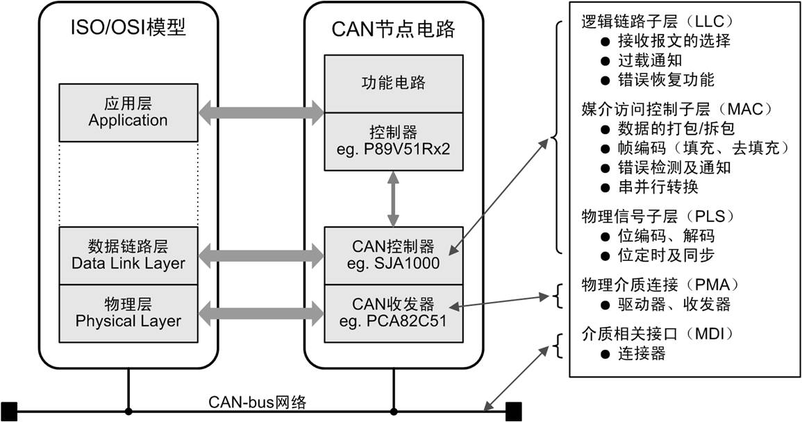

# CAN-bus 介绍

* 现场总线
* CAN总线简介

### 现场总线

现场总线：Fieldbus，应用于工业现场，采用总线方式连接多个设备，用于传输工业现场各种数据的一类通信系统。

工业现场：不是狭义地指车间工厂，而是指主要**用于机器之间通信的场合**。

现场总线种类很多，它们具有以下一些基本共性：

* 开放性：总线规范开放，任何厂家都可以设计生产基于某种现场总线的产品。
* 数字化及双向串行传输：以较低的布线成本实现远距离传输。
* 多点通信：在同一个通信网络上可以挂接多个设备。
* 能够满足工业控制现场复杂环境、实时通信、抗干扰等方面的要求。

### CAN总线简介

CAN：Controller Area Network，控制器局域网是一种能有效支持分布式控制和实时控制的串行通讯网络。

CAN-bus： Controller Area Network-bus，控制器局域网总线技术

* CAN-bus被制定成为国际标准：**ISO11898（高速）**和**ISO11519（低速）**
* CAN-bus总线的两大应用层协议：**CANopen协议**与**DeviceNet协议**

CAN-bus规范定义了ISO模型中的**物理层**和**数据链路层**。

一些国际组织定义了应用层，如CiA组织的CANopen、ODVA组织的DeviceNet等，也有一些用户根据需求自行设计应用层。
