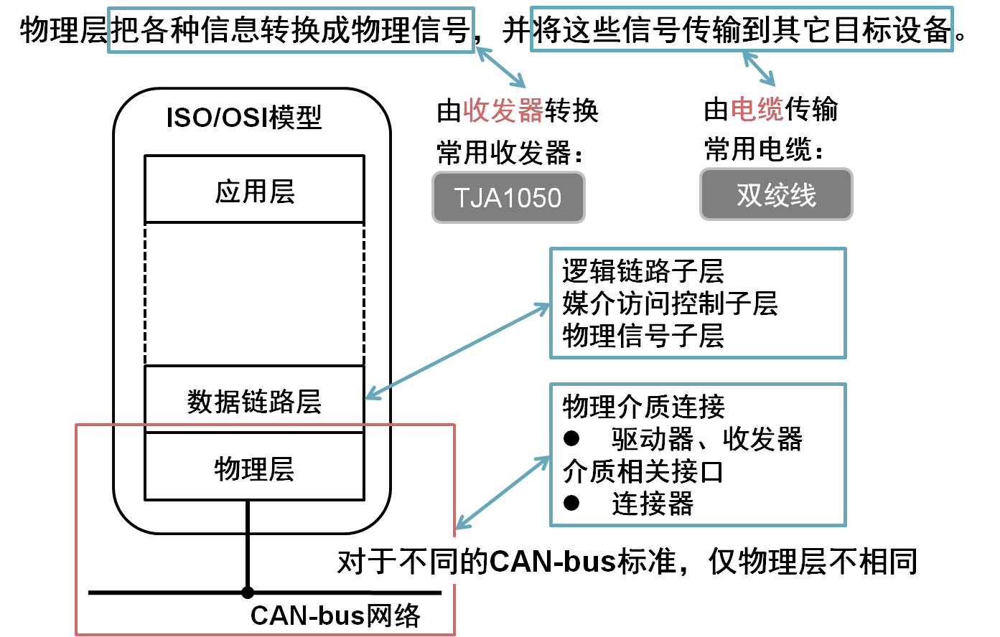

# CAN-bus 物理层

* CAN-bus物理层简介
* CAN收发器与信号电平
* 接插件
* 线与原理
* 同步与位填充
* 传输速率与距离
* 终端电阻

### CAN-bus物理层简介

### CAN收发器

负责逻辑信号和物理信号之间的转换。

    将逻辑信号转换成物理信号。此收发器转换得到的信号为差分电平信号。
    将物理信号转换成逻辑信号。此收发器将差分电平信号转换为逻辑信号。

### 信号电平

CAN-bus发布了ISO11898和ISO11519两个通信标准，此两个标准中差分电平的特性不相同。

#### 双绞线对抑制共模干扰的抑制原理

双绞线上传输差分信号，共模干扰使信号线上产生相同幅度和相位的干扰脉冲.

线路受到共模信号干扰后，信号差值不变，信号依然正确传输。

### CAN接插件

### 线与原理

多个节点并接到同一总线上时，只要其中一个节点输出低电平，总线就为低电平，只有所有节点输出高电平时，总线才为高电平。

### 同步与位填充

#### 同步通信与异步通信

#### 异步通信中波特率带来的误差

波特率误差累计后产生通信错误

#### 消除波特率误差产生的通信错误

* 提高时钟精度，使波特率尽量接近标准波特率。此方法使设备成本激增，只能减少误差，仍无法消除累计误差。
* 同步：隔一段时间后所有节点时钟计时归0一次。此方案经济可靠，可以消除累计误差。

CAN-bus作为异步串行通信协议，使用了“同步”的解决方案

#### CAN-bus异步串行通信中的“同步”解决方案

**CAN-bus规定信号的跳变沿时刻进行同步。**

#### 位填充
    

**CAN-bus通过位填充提供同步信号，从而消除累计误差。**

### 传输速率与距离

CAN —— Control Area Network 的缩写，属于小范围实时通信网络，通信距离与速率成反比。

### 终端电阻

**终端电阻用于减少通信线路上的反射，避免引起电平变化而导致数据的传输信错误。**

终端电阻的接法有两种：

### CAN-bus物理层小结

* 规范信号电平标准（高低速两种）
* 信号同步与位填充技术以解决异步通信的“同步”问题
* 规范通信速率与距离
* 规范终端电阻（高低速两种），较少通信电路反射引起的电平变化
