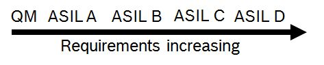
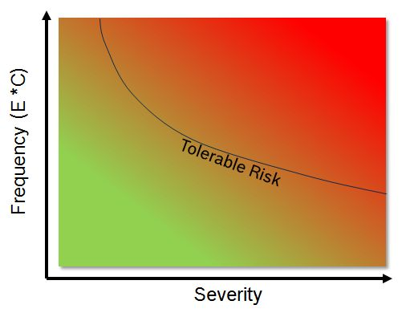
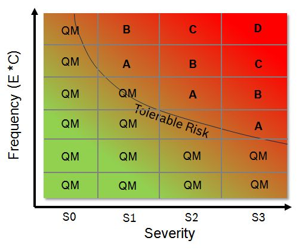

# ISO26262

### 什么是功能安全

    按通俗的理解而言，功能安全就是指汽车即便出现了故障，这个故障也是可控的，不会出现“玩脱了”的情况。实现功能安全是汽车设计的主要目标，也是评价汽车设计的重要标准。

### 什么是ISO26262

    Road Vehicles – Functional Safety 是一个适用于汽车电子/电气系统的国际标准。
    这个标准对汽车的研发、生产、测试、售后等整个生命周期，在文档管理、流程规划、功能设计和任务执行等方面进行了具体的指导，并提出了一系列要求，最终使产品达到功能安全的目标。

##### ISO26262中最重要的三部分内容

* “V”型开发流程
* ASIL概念
* 功能安全设计开发流程

### ASIL

#### ASIL的定义

> ASIL（Automotive Safety Integrity Level）是用来描述一项需求(Requirement)的安全严格等级的概念。
> 它由低到高分为A、B、C、D四个级别，除此之外还有一个非安全需求的QM（Quality Management）级。
> 粗略而言，ASIL D级别的需求，一旦发生故障则具有相当高的安全风险，会导致严重的安全后果，往往危及人员生命安全.
> 而对于ASIL A级别的需求，安全风险就很小了，就算出了故障也无所谓。

- 

#### ASIL 的评级

* Exposure（E）: 是指故障发生的时长占平均运行时长的比例，用来表征故障发生的概率大小。E值越大则故障发生的概率越大。
* Controllability（C）: 是指故障发生以后，驾驶员是否可以人为对故障状态加以控制。C值越大则越难以控制。
* Severity（S）: 故障的严重程度。S值越大则故障越严重。S值分由轻微到严重为S0至S3共四级。
* Risk = E * C * S
* Tolerable Risk: 对比标准

把以上四个概念绘制在一个图表中，以S为横轴，E*C 为纵轴，就可以得到以下一张ASIL评级图：

- 

从图中我们可以看出，左下角的安全风险最低，而右上角部分的安全风险最高，并且有Tolerable Risk线把图分为了两部分。
Tolerable Risk 线以下的部分，就好比“比地震风险还低”的部分，不需要给予特别关注，可以直接评为非安全需求的QM级；
而线以上的部分，就具有显著的安全风险，需要进行ASIL评级，最右上角评为D级，向左下依次评为C、B、A级。

- 

### References

* https://www.zhihu.com/question/27719391
