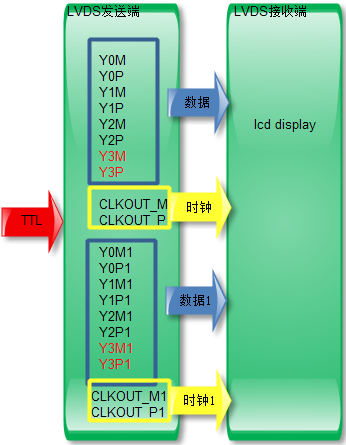

# LCD

### LCD常见接口(内部数据传输接口)

* TTL（RGB）
* LVDS
* EDP
* MIPI

### 显示器接口（外部接口）

* VGA
* DVI
* HDMI
* DisplayPort（DP）

## LCD数据传输接口

### TTL -- Transistor Transistor Logic （晶体管-晶体管逻辑）

TTL接口属于并行方式传输数据的接口

采用这种接口时，不必在液晶显示器的驱动板端和液晶面板端使用专用的接口电路，
而是由驱动板主控芯片输出的TTL数据信号经电缆线直接传送到液晶面板的输人接口。

TTL接口信号电压高、连线多、传输电缆长，因此，电路的抗干扰能力比较差，而且容易产生电磁干扰（EMI）。

在实际应用中，TTL接口电路多用来驱动小尺寸（15in以下）或低分辨率的液晶面板。TTL最高像素时钟只有28MHz。

早期的数字处理芯片都是TTL的，也就是RGB直接输出到TFT-LCD。

#### TTL接口的信号类型

驱动板TTL输出接口中一般包含RGB数据信号、时钟信号和控制信号这三大类信号。如下图所示：

##### RGB数据信号

单通道TTL
* 单通道6bit TTL输出接口(18bitTTL接口)
* 单通道8bit TTL输出接口(24bitTTL接口)

双通道TTL: 两组RGB数据，分为奇通道、偶通道，时钟有的也分为OCLK/ECLK,有的共用一个
* 双通道6bit TTL输出接口
* 双通道8bit TTL输出接口

##### 时钟信号

像素时钟信号，是传输数据和对数据信号进行读取的基准

在使用奇/偶像素双路方式传输RGB数据时，不同的输出接口使用像素时钟的方法有所不同。

有的输出接口奇/偶像素双路数据共用一个像素时钟信号，有的输出接口奇/偶两路分别设置奇数像素数据时钟和偶数像素两个时钟信号，以适应不同液晶面板的需要。

##### 控制信号

控制信号包括数据使能信号（或有效显示数据选通信号）DE、行同步信号HS、场同步信号VS。

### LVDS -- Low Voltage Differential Signaling（低压差分信号技术接口）

克服以TTL电平方式传输宽带高码率数据时功耗大、EMI电磁干扰大等缺点而研制的一种数字视频信号传输方式。

信号在差分PCB线或平衡电缆上以几百Mbit／s的速率传输，采用低压和低电流驱动方式，实现了低噪声和低功耗。

#### LVDS接口组成

LVDS接口电路包括两部分，即主板侧的LVDS输出接口电路（LVDS发送端）和液晶面板侧的LVDS输入接口电路（LVDS接收器）。

LVDS发送端将TTL信号转换成LVDS信号，然后通过驱动板与液晶面板之间的柔性电缆（排线）将信号传送到液晶面板侧的LVDS接收端的LVDS解码IC中。

LVDS接收器再将串行信号转换为TTL电平的并行信号，送往液晶屏时序控制与行列驱动电路。

#### LVDS接口的信号类型

LVDS信号有数据差分和时钟差分信号组成。

##### 单通道LVDS

单通道6位数据（如果是6位的Y3M/P这组红色的线没有）
    
    有4组差分线，3组信号线，一组时钟线。Y0M、Y0P、Y1M、Y1P、Y2M、Y2P、CLKOUT_M、CLKOUT_P

单通道8位数据
    
    有5组差分线，4组信号线，一组时钟线。分别是Y0M、Y0P、Y1M、Y1P、Y2M、Y2P、CLKOUT_M、CLKOUT_P。

##### 双通道LVDS

LVDS在传输分辨率较高的数据时，抗干扰能力比较强，可是1920*1080以上分辨率时，单路不堪重负，所以有双路接口出现。目的很简单，加快速度，增强抗干扰能力。

双通道6位数据

    刚好是单通道的两倍，时钟也是两路，红色部分：Y3M、Y3P、Y3M1、Y3M1这两组信号不接。

双通道8位数据

    和前面的比较类似。

### EDP

### MIPI接口

### LCD接口转换

* SN75LVDS83B/THC63LVD827：TTL(RGB)转LVDS

## 显示器接口

### VGA -- Video Graphics Array

其他的名称包括RGB端子，D-sub 15，或mini D15，是一种3排共15针的DE-15

VGA通常与DVI标准共存，但VGA和DVI正在迅速淘汰，以支持更新和更紧凑的HDMI和DisplayPort接口

当播放更高分辨率的视频时，VGA传输带宽足够高，图像质量可能会因电缆质量和长度而下降。

VGA只有图像输入，没有声音输入。

### DVI -- Digital Visual Interface(数码视频接口)

视频接口标准，设计的目的是用来传输未经压缩的数字化影像。目前广泛应用于LCD、数字投影机等显示设备上。

随着实际功能的不同，DVI接头被分成三种类型：

* DVI-D（Digital数字讯号；single link或dual link）
* DVI-A（Analog模拟讯号）
* DVI-I（Integrated混合式；数字及模拟讯号皆可；single link或dual link）

某些较新型的DVD播放器，电视机（包括HDTV）以及投影机采用了所谓"DVI/HDCP"接头，这种接头在外型上完全与DVI相同，但是其传送的数据有经过HDCP协议所加密以防止非法复制。

### HDMI -- High Definition Multimedia Interface（高画质多媒体接口）

全数字化影像和声音传送接口，可以传送未压缩的音讯及视频信号。

HDMI 的出现取代了模拟信号视频，而DisplayPort的出现则取代的是DVI和VGA接口。

Type A HDMI：
    
    可向下兼容于现今多数显示器与显示适配器所使用的Single-link DVI-D或DVI-I接口（但不支持DVI-A）。
    
    应用于HDMI1.0版本，总共有19pin，规格为4.45 mm×13.9 mm，为最常见的HDMI接头规格，相对等于DVI Single-Link传输

Type B HDMI：
    
    向下兼容于Dual-link DVI接口
    
    应用于HDMI1.0版本，规格为4.45 mm×21.2 mm，总共有29pin,可传输HDMI A type两倍的TMDS数据量，相对等于DVI Dual-Link传输，用于传输高分辨率（WQXGA 2560×1600以上）
    
    此类接口未应用在任何产品中。

### DP -- DisplayPort

视频电子标准协会（VESA）推动的数字式视讯接口标准。

发展中的新型数字式音频／视讯界面，主要适应于连接计算机和屏幕，或是计算机和家庭剧院系统。

有意要取代旧有的VGA、DVI和FPD-Link（LVDS）视频传输接口技术。

Mini DisplayPort 
    
    微型版本的DisplayPort。由苹果公司于2008年10月14日发表

    现在应用于MacBook（取代先前的Mini-DVI）、MacBook Air（取代先前的Micro-DVI）与MacBook Pro（取代先前的DVI）笔记本计算机中。

优点
    
    DisplayPort内部传输数据方式与DVI、HDMI不同，所以不能像DVI与HDMI间互转那样一个转接头搞定。但可以透过芯片转接成D-sub、DVI、HDMI
    
    DisplayPort 1.2支持MST（Multi-Stream Transport），单个DP可连接到多个显示器。
    
    支援USB Type-C

### references

* https://blog.csdn.net/wocao1226/article/details/23870149
* https://www.zhihu.com/question/19571221

