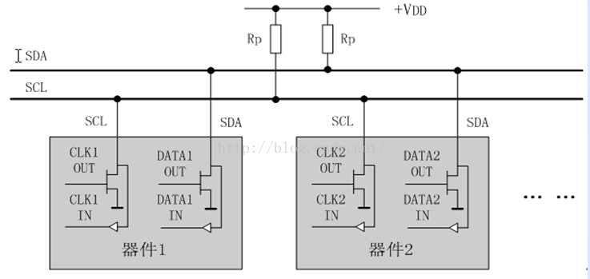

# IIC

### references

* https://www.cnblogs.com/zhangjiansheng/p/7738390.html
* https://www.cnblogs.com/bixiaopengblog/p/7469536.html
https://www.cnblogs.com/xiaomeige/p/6509414.html

I2C(Inter-Integrated Circuit BUS) 集成电路总线

    总线由NXP（原PHILIPS）公司设计，多用于主控制器和从器件间的主从通信，在小数据量场合使用，传输距离短，任意时刻只能有一个主机等特性

### IIC的物理层

* 只要求两条总线线路，一条是串行数据线ＳＤＡ，一条是串行时钟线ＳＣＬ。（IIC是半双工，而不是全双工）。
* 每个连接到总线的器件都可以通过唯一的地址和其它器件通信，主机/从机角色和地址可配置，主机可以作为主机发送器和主机接收器。
* IIC是真正的多主机总线，可以在通讯过程中，改变主机，如果两个或更多的主机同时请求总线，可以通过冲突检测和仲裁防止总线数据被破坏
* 传输速率在标准模式下可以达到100kb/s,快速模式下可以达到400kb/s
* 连接到总线的IC数量只是受到总线的最大负载电容400pf限制

### IIC的协议层

##### 数据的有效性

在时钟的高电平周期内，SDA线上的数据必须保持稳定，数据线仅可以在时钟SCL为低电平时改变

##### 起始和结束条件

起始条件：当SCL为高电平的时候，SDA线上由高到低的跳变被定义为起始条件
结束条件：当SCL为高电平的时候，SDA线上由低到高的跳变被定义为停止条件
总线在起始条件之后，视为忙状态，在停止条件之后被视为空闲状态

##### 应答

每当主机向从机发送完一个字节的数据，主机总是需要等待从机给出一个应答信号，以确认从机是否成功接收到了数据。
从机应答主机所需要的时钟仍是主机提供的，应答出现在每一次主机完成8个数据位传输后紧跟着的时钟周期，低电平0表示应答，1表示非应答。

##### 数据帧格式

* I2C总线上传送的数据信号是广义的，既包括地址信号，又包括真正的数据信号
* 在起始信号后必须传送一个从机的地址（7位），第8位是数据的传送方向位（R/T），用“0”表示主机发送数据（T），“1”表示主机接收数据（R）
* 每次数据传送总是由主机产生的终止信号结束。但是，若主机希望继续占用总线进行新的数据传送，则可以不产生终止信号，马上再次发出起始信号对另一从机进行寻址

在总线的一次数据传输过程中，可以有以下几种组合方式：

[1] 主机向从机发送数据，数据传送方向在整个传送过程中不变：

[2]主机在第一个字节后，立即从从机读数据:

[3]在传送过程中，当需要改变传送方向时，起始信号和从机地址都被重复产生一次，但两次读/写方向位正好反相：

