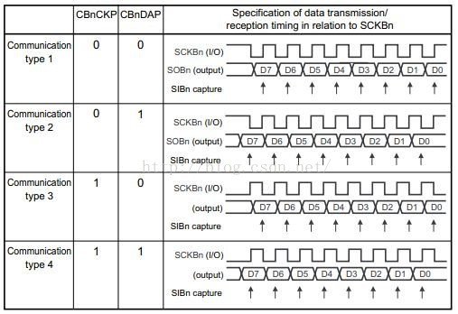
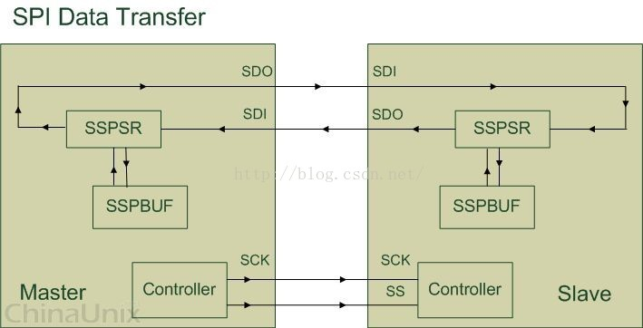
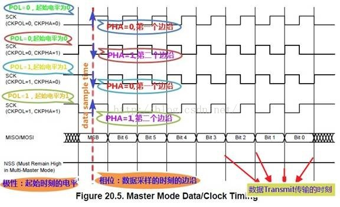

# SPI -- Serial Peripheral interface（串行外围设备接口）

    Motorola首先在其MC68HCXX系列处理器上定义的，主要应用在 EEPROM，FLASH，实时时钟，AD转换器，还有数字信号处理器和数字信号解码器之间。
    一种高速的，全双工，同步的通信总线，并且在芯片的管脚上只占用四根线，节约了芯片的管脚，同时为PCB的布局上节省空间，提供方便。

### SPI特点

#### 采用主-从模式(Master-Slave) 的控制方式

SPI 规定了两个 SPI 设备之间通信必须由主设备 (Master) 来控制次设备 (Slave).
一个 Master 设备可以通过提供 Clock 以及对 Slave 设备进行片选 (Slave Select) 来控制多个 Slave 设备。
SPI 协议还规定 Slave 设备的 Clock 由 Master 设备通过 SCK 管脚提供给 Slave 设备,。
Slave 设备本身不能产生或控制 Clock, 没有 Clock 则 Slave 设备不能正常工作。

#### 采用同步方式(Synchronous)传输数据

Master 设备会根据将要交换的数据来产生相应的时钟脉冲(Clock Pulse), 时钟脉冲组成了时钟信号(Clock Signal) , 时钟信号通过时钟极性 (CPOL) 和 时钟相位 (CPHA) 控制着两个 SPI 设备间何时数据交换以及何时对接收到的数据进行采样, 来保证数据在两个设备之间是同步传输的.

#### 数据交换(Data Exchanges)

SPI 设备间的数据传输之所以又被称为数据交换。
SPI 协议规定一个 SPI 设备不能在数据通信过程中仅仅只充当一个 "发送者(Transmitter)" 或者 "接收者(Receiver)".
在每个 Clock 周期内, SPI 设备都会发送并接收一个 bit 大小的数据, 相当于该设备有一个 bit 大小的数据被交换了.
一个 Slave 设备要想能够接收到 Master 发过来的控制信号, 必须在此之前能够被 Master 设备进行访问 (Access).
所以, Master 设备必须首先通过 SS/CS pin 对 Slave 设备进行片选, 把想要访问的 Slave 设备选上.
在数据传输的过程中, 每次接收到的数据必须在下一次数据传输之前被采样.
如果之前接收到的数据没有被读取, 那么这些已经接收完成的数据将有可能会被丢弃, 导致 SPI 物理模块最终失效.
因此, 在程序中一般都会在 SPI 传输完数据后, 去读取 SPI 设备里的数据, 即使这些数据(Dummy Data)在我们的程序里是无用的。

#### SPI有四种传输模式

上升沿、下降沿、前沿、后沿触发。当然也有MSB和LSB传输方式.

- 

#### SPI只有主模式和从模式之分

没有读和写的说法，因为实质上每次SPI是主从设备在交换数据。也就是说，你发一个数据必然会收到一个数据；你要收一个数据必须也要先发一个数据。

### 工作机制

#### 概述

- 

* SSPBUF(Synchronous Serial Port Buffer), 泛指 SPI 设备里面的内部缓冲区, 一般在物理上是以 FIFO 的形式, 保存传输过程中的临时数据;
* SSPSR(Synchronous Serial Port Register), 泛指 SPI 设备里面的移位寄存器(Shift Regitser),它的作用是根据设置好的数据位宽(bit-width)把数据移入或者移出SSPBUF;
* Controller,泛指 SPI 设备里面的控制寄存器, 可以通过配置它们来设置SPI总线的传输模式

通常情况下, 我们只需要对上图所描述的四个管脚(pin) 进行编程即可控制整个 SPI 设备之间的数据通信

* SCK, Serial Clock, 主要的作用是 Master 设备往 Slave 设备传输时钟信号, 控制数据交换的时机以及速率;
* SS/CS, Slave Select/Chip Select, 用于 Master 设备片选 Slave 设备, 使被选中的 Slave 设备能够被 Master 设备所访问;
* SDO/MOSI, Serial Data Output/Master Out Slave In, 在 Master 上面也被称为 Tx-Channel, 作为数据的出口, 主要用于 SPI 设备发送数据;
* SDI/MISO, Serial Data Input/Master In Slave Out, 在 Master 上面也被称为 Rx-Channel, 作为数据的入口, 主要用于SPI 设备接收数据;

SPI 设备在进行通信的过程中, Master 设备和 Slave 设备之间会产生一个数据链路回环(Data Loop), 就像上图所画的那样, 通过 SDO 和 SDI 管脚, SSPSR 控制数据移入移出 SSPBUF, Controller 确定 SPI 总线的通信模式, SCK 传输时钟信号。

#### Timing

##### SPI相关的缩写或说法

SPI的极性Polarity和相位Phase，最常见的写法是CPOL和CPHA，不过也有一些其他写法，简单总结如下：
(1) CKPOL (Clock Polarity) = CPOL = POL = Polarity = （时钟）极性
(2) CKPHA (Clock Phase) = CPHA = PHA = Phase = （时钟）相位
(3) SCK=SCLK=SPI的时钟
(4) Edge=边沿，即时钟电平变化的时刻，即上升沿(rising edge)或者下降沿(falling edge)

对于一个时钟周期内，有两个edge，分别称为：
Leading edge=前一个边沿=第一个边沿，对于开始电压是1，那么就是1变成0的时候，对于开始电压是0，那么就是0变成1的时候；
Trailing edge=后一个边沿=第二个边沿，对于开始电压是1，那么就是0变成1的时候（即在第一次1变成0之后，才可能有后面的0变成1），对于开始电压是0，那么就是1变成0的时候；

##### SPI的相位和极性

CPOL和CPHA，分别都可以是0或时1，对应的四种组合就是：
* Mode 0 CPOL=0, CPHA=0
* Mode 1 CPOL=0, CPHA=1
* Mode 2 CPOL=1, CPHA=0
* Mode 3 CPOL=1, CPHA=1

##### CPOL极性

Clock Polarity = IDLE state of SCK
SPI的CPOL，表示当SCLK空闲idle的时候，其电平的值是低电平0还是高电平1：
CPOL=0，时钟空闲idle时候的电平是低电平，所以当SCLK有效的时候，就是高电平，就是所谓的active-high；
CPOL=1，时钟空闲idle时候的电平是高电平，所以当SCLK有效的时候，就是低电平，就是所谓的active-low；

##### CPHA相位

capture strobe = latch = read = sample, 都是表示数据采样，数据有效的时刻
相位，对应着数据采样是在第几个边沿（edge），是第一个边沿还是第二个边沿，0对应着第一个边沿，1对应着第二个边沿。
对于：
CPHA=0，表示第一个边沿：
对于CPOL=0，idle时候的是低电平，第一个边沿就是从低变到高，所以是上升沿；
对于CPOL=1，idle时候的是高电平，第一个边沿就是从高变到低，所以是下降沿；
CPHA=1，表示第二个边沿：
对于CPOL=0，idle时候的是低电平，第二个边沿就是从高变到低，所以是下降沿；
对于CPOL=1，idle时候的是高电平，第一个边沿就是从低变到高，所以是上升沿；

- 

##### 软件中如何设置SPI的极性和相位

SPI分主设备和从设备，两者通过SPI协议通讯。
而设置SPI的模式，是从设备的模式，决定了主设备的模式。
所以要先去搞懂从设备的SPI是何种模式，然后再将主设备的SPI的模式，设置和从设备相同的模式，即可正常通讯。

* 固定的，有SPI从设备硬件决定的: SPI从设备，具体是什么模式，相关的datasheet中会有描述，需要自己去datasheet中找到相关的描述
* 可配置的，由软件自己设定: 从设备也是一个SPI控制器，4种模式都支持，此时只要自己设置为某种模式即可

#### SSPSR

SSPSR 是 SPI 设备内部的移位寄存器(Shift Register). 它的主要作用是根据 SPI 时钟信号状态, 往 SSPBUF 里移入或者移出数据, 每次移动的数据大小由 Bus-Width 以及 Channel-Width 所决定。

Bus-Width 的作用是指定地址总线到 Master 设备之间数据传输的单位.
例如, 我们想要往 Master 设备里面的 SSPBUF 写入 16 Byte 大小的数据: 首先, 给 Master 设备的配置寄存器设置 Bus-Width 为 Byte;
然后往 Master 设备的 Tx-Data 移位寄存器在地址总线的入口写入数据, 每次写入 1 Byte 大小的数据(使用 writeb 函数);
写完 1 Byte 数据之后, Master 设备里面的 Tx-Data 移位寄存器会自动把从地址总线传来的1 Byte 数据移入 SSPBUF 里; 上述动作一共需要重复执行 16 次.

Channel-Width 的作用是指定 Master 设备与 Slave 设备之间数据传输的单位.
与 Bus-Width 相似, Master 设备内部的移位寄存器会依据 Channel-Width 自动地把数据从 Master-SSPBUF 里通过 Master-SDO 管脚搬运到 Slave 设备里的 Slave-SDI 引脚, Slave－SSPSR 再把每次接收的数据移入 Slave-SSPBUF里.
通常情况下, Bus-Width 总是会大于或等于 Channel-Width, 这样能保证不会出现因 Master 与 Slave 之间数据交换的频率比地址总线与 Master 之间的数据交换频率要快, 导致 SSPBUF 里面存放的数据为无效数据这样的情况.

#### SSPBUF

在每个时钟周期内, Master 与 Slave 之间交换的数据其实都是 SPI 内部移位寄存器从 SSPBUF 里面拷贝的.
我们可以通过往 SSPBUF 对应的寄存器 (Tx-Data / Rx-Data register) 里读写数据, 间接地操控 SPI 设备内部的 SSPBUF.
例如, 在发送数据之前, 我们应该先往 Master 的 Tx-Data 寄存器写入将要发送出去的数据, 这些数据会被 Master-SSPSR 移位寄存器根据 Bus-Width 自动移入 Master-SSPBUF 里.
然后这些数据又会被 Master-SSPSR 根据 Channel-Width 从 Master-SSPBUF 中移出, 通过 Master-SDO 管脚传给 Slave-SDI 管脚,
Slave-SSPSR 则把从 Slave-SDI 接收到的数据移入 Slave-SSPBUF 里.
与此同时, Slave-SSPBUF 里面的数据根据每次接收数据的大小(Channel-Width), 通过 Slave-SDO 发往 Master-SDI,Master-SSPSR 再把从 Master-SDI 接收的数据移入 Master-SSPBUF.
在单次数据传输完成之后, 用户程序可以通过从 Master 设备的 Rx-Data 寄存器读取 Master 设备数据交换得到的数据.

#### Controller

Master 设备里面的 Controller 主要通过时钟信号(Clock Signal)以及片选信号(Slave Select Signal)来控制 Slave 设备.
Slave 设备会一直等待, 直到接收到 Master 设备发过来的片选信号, 然后根据时钟信号来工作.
Master 设备的片选操作必须由程序所实现. 例如: 由程序把 SS/CS 管脚的时钟信号拉低电平, 完成 SPI 设备数据通信的前期工作;
当程序想让 SPI 设备结束数据通信时, 再把 SS/CS 管脚上的时钟信号拉高电平.

### references

* https://blog.csdn.net/firefly_cjd/article/details/51935079

