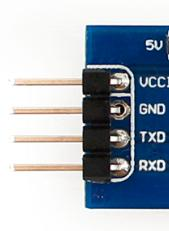
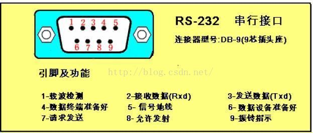

# UART

> 通用异步收发传输器（Universal Asynchronous Receiver/Transmitter)

### UART COM RS232 TTL的关系

* TTL、RS-232是指的电平标准(电信号)
* UART、COM口是指的物理接口形式(硬件)
* UART有4个pin（VCC, GND, RX, TX）,用的TTL电平,低电平为0(0V)，高电平为1（3.3V或以上）
- 
* COM口是我们台式机上面常用的口，9个pin， 用的RS232电平,  它是负逻辑电平，它定义+5~+12V为低电平，而-12~-5V为高电平
- 

### UART

* 一般uart控制器在嵌入式系统里面都做在cpu一起，像飞思卡尔的IMX6芯片就是这样，有多个uart控制器
* 使用UART口调试，常见的两种方法是：**1转COM口 2转USB口**，要想连上这两种接口都要需要进行**硬件接口转换**和**电平转换**
* UART连接COM口，则需实现TTL电平与RS232电平的转换
* UART连接USB口，则需实现TTL电平与USB电平的转换
* MAX232芯片实现TTL电平与RS232电平的转换
* PL2303、CP2102芯片实现USB电平与TTL电平的转换
* TTL标准是低电平为0，高电平为1（+5V电平）。RS-232标准是正电平为0，负电平为1（±15V电平）

